# **Projekt: Pociąg z Rowerami**

> **Autor**: Karol Kapusta  
> **Numer indeksu**: 151441  
> **Temat projektu**: Symulacja dworca kolejowego z obsługą pasażerów i rowerów.  

---

## 📑 **Spis treści**

1. [Cel projektu](#cel-projektu)  
2. [Cechy szczególne](#cechy-szczególne)  
3. [Struktura projektu](#struktura-projektu)  
4. [Przebieg symulacji](#przebieg-symulacji)  
5. [Wykorzystane technologie](#wykorzystane-technologie) 
6. [Schemat działania](#schemat-działania) 

---

## **Cel projektu**

Celem projektu jest stworzenie symulacji dworca kolejowego z dynamiczną obsługą pasażerów i rowerów. W skład systemu wchodzi:
- **Pociąg pasażerski** o ograniczonej liczbie miejsc na pasażerów i rowery,
- **Dworzec kolejowy**, na którym odbywa się załadunek,
- **Pasażerowie** oczekujący na możliwość wejścia do pociągu.

### **Założenia:**
1. Pociąg odjeżdża zgodnie z harmonogramem lub po pełnym załadunku.
2. System rejestruje wszystkich pasażerów i pociągi, umożliwiając ich monitorowanie w czasie rzeczywistym.
3. Projekt wykorzystuje mechanizmy komunikacji międzyprocesowej (IPC), takie jak:
   - Semafory,
   - Pamięć współdzielona,
   - Kolejki komunikatów.

---

## **Cechy szczególne**

- **🕒 Dynamiczne warunki odjazdu**: Pociąg może odjechać, gdy:
  - Minie czas oczekiwania,
  - Zostanie w pełni załadowany.
  
- **⚙️ Parametryzowalność symulacji**:
  - Skala czasu,
  - Liczba pociągów i pasażerów,
  - Maksymalny czas oczekiwania na załadunek.

- **📊 Rejestracja danych**:
  - Zapisywanie informacji o pasażerach i pociągach w rejestrach.

- **📡 Informacje w czasie rzeczywistym**:
  - Wyświetlanie stanu symulacji w terminalu,
  - Tworzenie plików logów dla każdego procesu.

- **🛡️ Obsługa błędów systemowych**:
  - Wykorzystanie `perror()` i `errno` w celu diagnostyki.

---

## **Struktura projektu**

Projekt jest podzielony na kilka kluczowych komponentów, z których każdy pełni określoną funkcję:

### **1. mojeFunkcje**
- Zawiera funkcje do zarządzania:
  - **IPC** (alokacja pamięci współdzielonej, semafory, kolejki komunikatów),
  - Logami procesów,
  - Stałymi używanymi w symulacji.

### **2. Master**
- Główny proces, koordynujący całą symulację:
  - Uruchamianie procesów pasażerów, kierowników pociągów i zawiadowcy.
  - Monitorowanie zakończenia procesów potomnych.
  - Obsługa sygnałów takich jak `SIGINT`.

### **3. Zawiadowca stacji**
- Najważniejszy proces, odpowiedzialny za:
  - Zarządzanie ruchem pociągów,
  - Otwieranie i zamykanie wejść na peron,
  - Decyzję o odjeździe pociągu na podstawie załadunku lub czasu.

### **4. Kierownik pociągu**
- Reprezentuje pociąg i odpowiada za:
  - Załadunek pasażerów,
  - Rejestrację pociągu w systemie,
  - Komunikację z zawiadowcą o gotowości do odjazdu.

### **5. Pasażerowie**
- Niezależne procesy, które:
  - Oczekują na peronie,
  - Próbują wejść do pociągu,
  - Reagują na sygnały systemowe (np. `SIGUSR2`).

---

## **Przebieg symulacji**

### **1. Przygotowanie**
- Ustawienie parametrów symulacji w pliku `mojeFunkcje.h` (np. skala czasu, liczba pociągów).

### **2. Uruchomienie symulacji**
- Proces `Master` inicjalizuje wszystkie podprocesy:
  - Zawiadowcę,
  - Kierowników pociągów,
  - Pasażerów.

### **3. Załadunek pasażerów**
- Pasażerowie czekają na otwarcie wejść (semaforów).
- Kierownik monitoruje liczby pasażerów i rowerów, dbając o ich ograniczenia.

### **4. Odjazd pociągu**
- Zawiadowca podejmuje decyzję o odjeździe:
  - Na podstawie pełnego załadunku,
  - Po upływie określonego czasu.

### **5. Zakończenie symulacji**
- Po przewiezieniu wszystkich pasażerów proces `Master` zamyka symulację.

---

## **Wykorzystane technologie**

Projekt został stworzony przy użyciu następujących narzędzi i technologii:

- **Język programowania**: C
- **Mechanizmy IPC**:
  - Semafory,
  - Pamięć współdzielona,
  - Kolejki komunikatów.
- **Narzędzia systemowe**:
  - `perror()` i `errno` do obsługi błędów,
  - Obsługa sygnałów systemowych (`SIGINT`, `SIGUSR1`, `SIGUSR2`).
- **LOG-owanie**:
  - Tworzenie logów w czasie rzeczywistym,
  - Debugowanie z wykorzystaniem flag debugowych.

---

## **Schemat działania**

Poniższy diagram ilustruje ***poglądowy*** (dla starszej wersji) przepływ informacji i komunikacji między procesami w projekcie:

```mermaid
---
config:
  layout: elk
  theme: base
---
flowchart TD
 subgraph s1["Główna pętla zawiadowcy"]
        Z5["Powiadomienie kierownika że może wjechać"]
        Z15["Otworzenie bramek"]
        Z6["Tworzenie procesów sprawdzających warunki odjazdu"]
        z10["Proces sprawdzający czy pociag nie stoi już za długo"]
        z11["Wydanie sygnału SIGUSR1 dla kierownika"]
        z12["Proces czekający na wiadomość od kierownika czy pociąg jest pełny"]
        Z7["Zamykanie bramek na peronie"]
        Z8["Czekanie na następny pociąg"]
        Z13["Sprawdź czy jeszcze został jakiś pociąg w rejestrze"]
        Z14["Jeśli jeden proces się skończył, zabij drugi"]
  end
 subgraph Zawiadowca["Zawiadowca"]
        Z0["Początek"]
        Z1["Inicjalizacja zasobów: semafory, pamięć współdzielona, kolejki"]
        Z2["Oczekiwanie na komunikat o przyjeździe pierwszego pociągu"]
        Z9["Koniec pracy i usuwanie zasobów"]
        s1
  end
 subgraph GlowwnaPetlaKierownika["Główna pętla kierownika"]
        K13["Powiadomienie zawiadowcy, że pociąg czeka na wjazd"]
        K3["Czekanie na zgodę na wjazd"]
        K4["Obsługa pasażerów bez rowerów"]
        K5["Obsługa pasażerów z rowerami"]
        K6["Ładuj dopóki nie ma maksymalnej liczby pasażerów i rowerów lub nie otrzyma sygnału o przerwaniu ładowania"]
        K7["Czekaj na zezwolenie na odjazd"]
        K17["Sprawdź czy pominięto załadunek ze względu na brak pasażerów"]
        K8["Sleep - symulacja podróży do miejsca docelowego"]
        K9["Reset liczników pasażerów i rowerów"]
        K10["Powrót na stację"]
        K21["Wyślij komunikat do zawiadowcy o pełnym załadunku"]
  end
 subgraph Kierownik["Kierownik"]
        K0["Początek"]
        K1["Inicjalizacja zasobów: semafory, pamięć współdzielona, kolejki"]
        K2["Rejestracja pociągu w pamięci współdzielonej"]
        K20["Koniec pracy"]
        Z31["Obsługa sygnałów nadawanych przez zawiadowcę stacji"]
        Z32["Reagowanie na sygnały SIGUSR1"]
        Z33["Pomiń załadunek"]
        GlowwnaPetlaKierownika
  end
 subgraph Pasazerowie["Pasazerowie"]
        P0["Początek"]
        P1["Losowe generowanie pasażera z rowerem lub bez (30% na rower)"]
        P2["Czekanie na dostęp do peronu"]
        P3["Wysyłanie komunikatu o gotowości do kierownika"]
        P4["Obsługa sygnałów nadawanych przez zawiadowcę stacji"]
        P5["Otrzymanie SIGINT koniec podróży"]
        P6["Sleep, symulacja podróży"]
        P17["Czeka na semaforze"]
        P7["Reagowanie na sygnały SIGUSR2"]
        P8["Powrót na platformę"]
  end
 subgraph WspolneZasoby["WspolneZasoby"]
        Kolejka0["Kolejka komunikatów 0: Czekający pasażerowie z bagażem podręcznym"]
        Kolejka1["Kolejka komunikatów 1: Czekający pasażerowie z rowerami"]
        Kolejka2["Kolejka komunikatów 2: Kolejka z informacjami o pociagach czekających na wjazd na peron"]
        Kolejka3["Kolejka komunikatów 3: Kanał komunikacyjny dla pociągów na peronie i zawiadowcy stacji"]
        Pamiec1["Pamięć współdzielona 1: Rejestr z PIDami pociągów aktualnie pracujących dla zawiadowcy stacji"]
        Semafor1["Semafor 1: Para semaforów symulująca działanie bramek na peronie"]
        Semafor2["Semafor 2: Para semaforów symulująca otwieranie się wejść do pociągu"]
        Semafor3["Semafor 3: Semafor kontrolujący jednoczesny dostęp do rejestru pociągów, patrz: Pamięć współdzielona 1"]
  end
    Z31 --> Z32
    Z32 --> Z33
    Z2 -- Komunikat o przyjeździe pociągu --> Z5
    K1 --> K2
    K2 -- Zarejestrowano pociąg --> K13
    K3 --> K4
    K4 --> K5 & Semafor2
    K5 --> K6 & Semafor2
    K6 -- Pełny załadunek --> K21
    K7 -- Sygnał do odjazdu --> K8
    K8 -- Dotarcie do celu --> K9
    K9 --> K10
    P1 --> P2
    P4 -- Obsługa sygnałów --> P7
    P7 -- SIGUSR2 --> P8
    P6 --> P5
    P3 -- Czeka na semafor --> P17
    P3 -- Jeśli ma rower --> Kolejka1
    P3 -- Jeśli nie ma rowera --> Kolejka0
    P2 --> P3
    Kolejka0 --> K4
    Kolejka1 --> K5
    Semafor2 -- Semafor pozwala na wejście --> P17
    P0 --> P1
    Z0 --> Z1
    Z1 --> Z2
    Z5 --> Z15 & Kolejka3
    Z15 --> Z6 & Semafor1
    Z6 --> z10 & z12
    z10 --> z11
    z11 --> Z14
    z12 --> Z14
    Z14 --> Z7
    Z7 --> Z8 & Semafor1
    Z8 --> Z13
    Z13 -- Jeśli nie --> Z9
    Z13 -- Jeśli tak --> Z5
    K0 --> K1
    K13 --> K3 & Kolejka2
    K6 --> K4
    K6 -- Otrzymanie sygnału SIGUSR1 o przerwaniu ładowania --> K17
    K17 -- Jeśli jednak ktoś jest w środku pociągu --> K8
    K17 -- Jeśli tak --> K20
    Pamiec1 --> Z13
    K2 --> Pamiec1
    Kolejka2 --> Z2 & Z8
    Semafor1 --> P2
    z11 -- Wysłanie sygnału --> K6
    Kolejka3 --> K3 & z12
    P17 --> P6
    K9 -- SIGINT --> P5
    K21 --> K7 & Kolejka3
    P17 -- SIGUSR2 --> P2
    style Z5 fill:#E1BEE7
    style Z15 fill:#E1BEE7
    style Z6 fill:#FFF9C4
    style z10 fill:#FFF9C4
    style z11 fill:#E1BEE7
    style z12 fill:#E1BEE7
    style Z7 fill:#E1BEE7
    style Z8 fill:#E1BEE7
    style Z13 fill:#E1BEE7
    style Z14 fill:#FFF9C4
    style Z0 fill:#BBDEFB
    style Z2 fill:#E1BEE7
    style Z9 fill:#FFCDD2
    style K13 fill:#E1BEE7
    style K3 stroke:#757575,fill:#BBDEFB
    style K17 fill:#BBDEFB
    style K10 fill:#C8E6C9
    style K21 fill:#E1BEE7
    style K0 fill:#BBDEFB
    style K20 fill:#FFCDD2
    style Z32 fill:#C8E6C9
    style P0 fill:#BBDEFB
    style P5 fill:#FFCDD2
    style P17 fill:#E1BEE7
    style P7 fill:#FFCDD2
    style Kolejka0 fill:#E1BEE7
    style Kolejka1 fill:#E1BEE7
    style Kolejka2 fill:#E1BEE7
    style Kolejka3 fill:#E1BEE7
    style Pamiec1 fill:#E1BEE7
    style Semafor1 fill:#E1BEE7
    style Semafor2 fill:#E1BEE7
    style Semafor3 fill:#E1BEE7
    linkStyle 7 stroke:#AA00FF,fill:none
    linkStyle 9 stroke:#AA00FF,fill:none
    linkStyle 19 stroke:#AA00FF,fill:none
    linkStyle 20 stroke:#AA00FF,fill:none
    linkStyle 22 stroke:#AA00FF,fill:none
    linkStyle 23 stroke:#AA00FF,fill:none
    linkStyle 24 stroke:#AA00FF,fill:none
    linkStyle 29 stroke:#AA00FF,fill:none
    linkStyle 31 stroke:#AA00FF,fill:none
    linkStyle 39 stroke:#AA00FF,fill:none
    linkStyle 45 stroke:#AA00FF,fill:none
    linkStyle 47 stroke:#00C853,fill:none
    linkStyle 50 stroke:#AA00FF,fill:none
    linkStyle 51 stroke:#AA00FF,fill:none
    linkStyle 52 stroke:#AA00FF,fill:none
    linkStyle 53 stroke:#AA00FF,fill:none
    linkStyle 54 stroke:#AA00FF,fill:none
```

---

📂 **Repozytorium projektu**:  
[🔗 Projekt SO Pociąg](https://github.com/SzerokiGeralt/Projekt-SO-Pociag)

> Projekt ilustruje zaawansowane techniki zarządzania procesami w systemach operacyjnych, jednocześnie dostarczając przyjazny w użyciu interfejs do symulacji dworca kolejowego.
